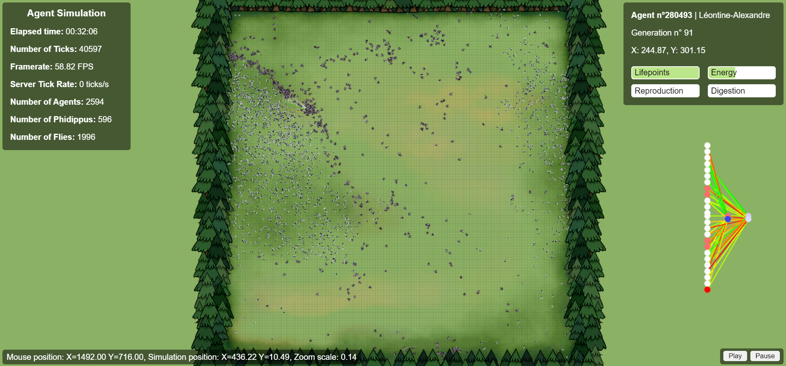

# Projet Phidippus Regius
### Contexte
Projet de Systèmes Multi-Agents (AI30/IA04).   
Les Phidippus Regius sont une espèce d'araignées se nourrissant d'insectes (drosophiles, mouches, etc.). Ce sont des araignées qui ne tissent pas de toile : elles chassent leurs proies. 
Nous avons ainsi développé une simulation suivant le modèle proie-prédateur mettant en scène des Phidippus et des drosophiles, afin d'observer leurs interactions et les évolutions des populations.

### Problématique
Peut-on voir des comportements intéressants et réalistes émerger en simulant des populations de Phidippus Regius et de drosophiles ?

### Résultats
Les résultats montrent que bien que la simulation ne soit pas complètement réaliste, elle s'approche de la réalité sur certains aspects, avec notamment l'observation de lois réelles (sélection naturelle, cycle proie-prédateur).

# Installation
### Prérequis
- Avoir installé Go
- Avoir installé Python
### Installation et lancement de l'application
- Cloner le projet dans un dossier
- Se placer dans le back, puis lancer la commande `go run .\main.go`
- Se placer dans le front, puis lancer la commande `python -m http.server 8000`
- Ouvrir un navigateur et se rendre à l'adresse `localhost:8000`