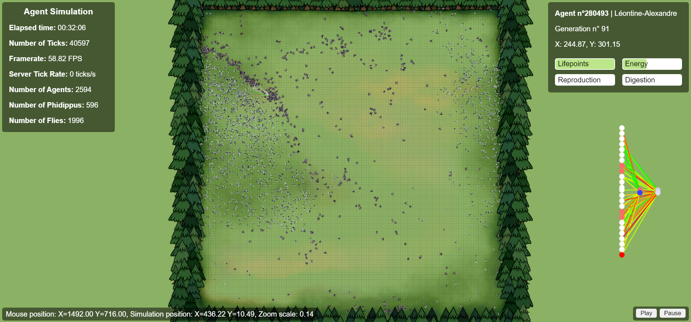

# Prey/Predator Simulation



## Project Description
This project is a prey/predator simulation featuring 2,600 autonomous agents. Each agent has a neural network brain implemented entirely from scratch, allowing it to make decisions based on its environment. The simulation demonstrates emergent behaviors and illustrates the theory of survival of the fittest, where only the most adaptive agents survive and reproduce.

## Prerequisites
- Go installed
- Python installed

## Installation on Linux
1. Clone the project to a local directory:
   ```bash
   git clone <project_URL>
   ```
2. Start the simulation:
   ```bash
   chmod +x ./starth.sh
   ./start.sh
   ```

## Optimization History

For a simulation with 2,600 agents (RTX3070ti, i7-12700H):

### Frontend
- **Base Version AVG Framerate**: 30 ms per frame
- **With "disableFriendlyErrors" Enabled**: 18 ms per frame
- **Using PixiJS with Containers and WebGL**: Reduced latency to 7 ms per frame (≈ 144 FPS)

## Technologies Used
- Backend: Go
- Frontend: JavaScript, PixiJS, HTML/CSS

## Features
- Real-time simulation with emergent behaviors
- Autonomous agents controlled by simple neural networks
- Smooth graphical visualization using PixiJS
